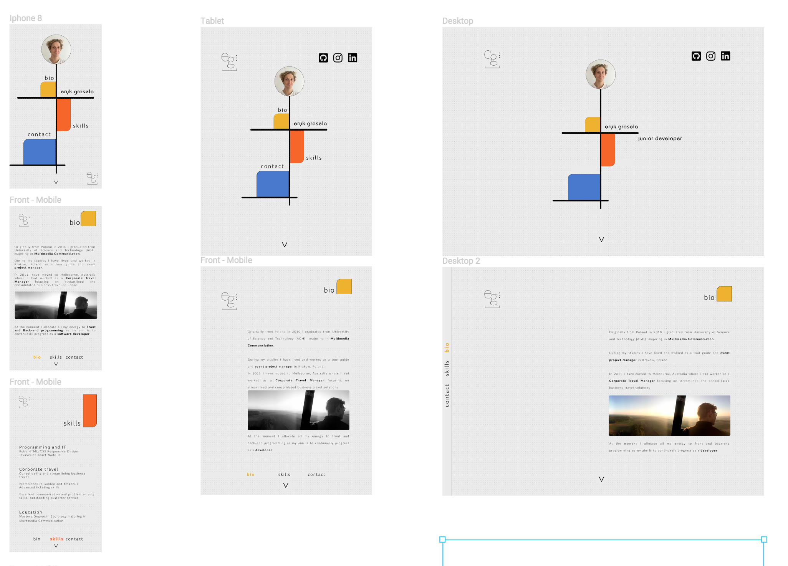
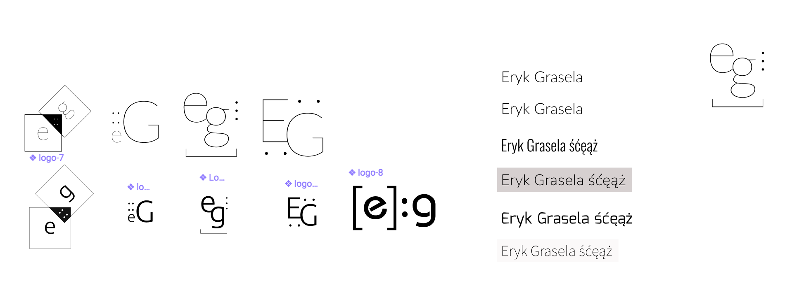

## My Website Project ##
http://eryk.netlify.com

### INTRO ###

My website presents my portfolio and inspirations as well as giving visitors access to different platforms where they can view my current work. The aim is to make a mark online where people can easily find me and contact me. 

### INSPIRATION ###

I have always been interested in Bauhaus, 20th Century Avant-Garde, Architecture and Modernism. Due to the fact that next year 2019 we will be celebrating 100 years of Bauhaus School of Art in Weimar, Germany my portfolio is a small tribute to those design principles that are still present and considered modern even 100 years later. 

- colors
    - Original colors were inspired by 20th century bauhaus and avant-garde movements. The final choice of the color pallette has been a result of trying different schemes. The original prime colors used in avant-garde were a lot stronger and intesnse. It is due to the fact that the message channelled through these in the last 100 years was very often political, with the aim of stripping art of its current layout and design standards. They needed to create new abstract forms. My final choice is meant to be a lot more contemporary and friendly. The portfolio is meant to be minimalistic however pragmatic and inviting. 

- design
    - the chosem theme required from me consistenty. I didn't want to copy any bauhaus or avant-garde art that you can find online however I wanted to pass on my own, contemporary version of it. The abstract element of the "canvas" are usable and practical through active links and smooth css stying

### WIREFRAMES AND STYLING ###

Full Figma here:

[Eryk Grasela Figma](https://www.figma.com/file/a2crCrJXKj7KWIKygRTHECSU/ver2figma?node-id=8%3A92)

### TYPOGRAPHY ###

I have decided to use Sans-Serif fonts due to their modest looks. I ended up with hero font of "Bauhaus" which is used only on the landing page for my name. The other 2 supporting fronts are "Ubuntu: thin" for titles/headers and "Lato: Thin" for content. Based on my reserach they complement each other very well and using "Bauhaus" make a strong enough contribution to the theme. 

### LOGO ###

I have considered multiple options for a simple clean logo evolving around my initials "EG". I was toying with the idea of using both small caps letters, mix of downcase and uppercase, and only uppercase. I ended up with , in my opinion , the cleanest downcase "EG" with 3 dots on the right hand side and a square bracket as a base for the logo. 

### Pintrest moodboard ###
[Pinterest](https://www.pinterest.com.au/erykgrasela/avant-garde/)

### Resources/TOOLS
I have used several different tools during the design and creation process. Listed below: 
* Figma
* Pintrest
* W3schools
* CSSTricks
* Codepen
* Stackoverflow

### CHALLENGES ###

The main challenge with the design was to stay truthful to the original concepts and principles of bauhaus/avant-garde however be able to recereate a modern, slick, minimalist design that will be easy and friendly to read. 

The technical challenge is to create all the elements of the slick design using css only. My passion for responsive design requires from me a strict regime while deisgning the layout and choosing humble css solutions.  

The landing page as proven to be quite challenging to use flexbox as I couldn't achieve the responsivnes that I would accept. 

I reverted back to grid which has allowed me to obtain the right ratio and proportions of the colourfull blocks.

I originally assumed a horizontal menu that will be set at about 20% margin from the bottom of the page like this: 

While it was looking very nice I realised it is taking a lot of valuable space on the page, particularly on a mobile design. 

I have decided to go with a left-hand sided fixed menu

### MENU ###

My final menu is fixed the left hand side of the page. 

On a desktop size screens it has a :hover effect that transitions the little blocks hidden behind the left margin:

On mobile devices the left hand side menu stays in the same position however the hover effects are disabled:

This solution allows maintaining the functionality and responsivnes at minimum effort. 

### FINAL PRODUCT ###

I am overall  happy with the final result despite of certain reponsivness issues on certain browsers models. 

It does work on most mobile and tablets which makes it very versitile. 

I have noticed that the background image repeat decided to end on some Chrome versions. 

I do think that the website clear and easy to read and my minimalist approach will get my brand accross. 

I will continue working on the content adding "projects" site which will include my actual work. At this stage visitors can view my work on GitHub and CodePen.